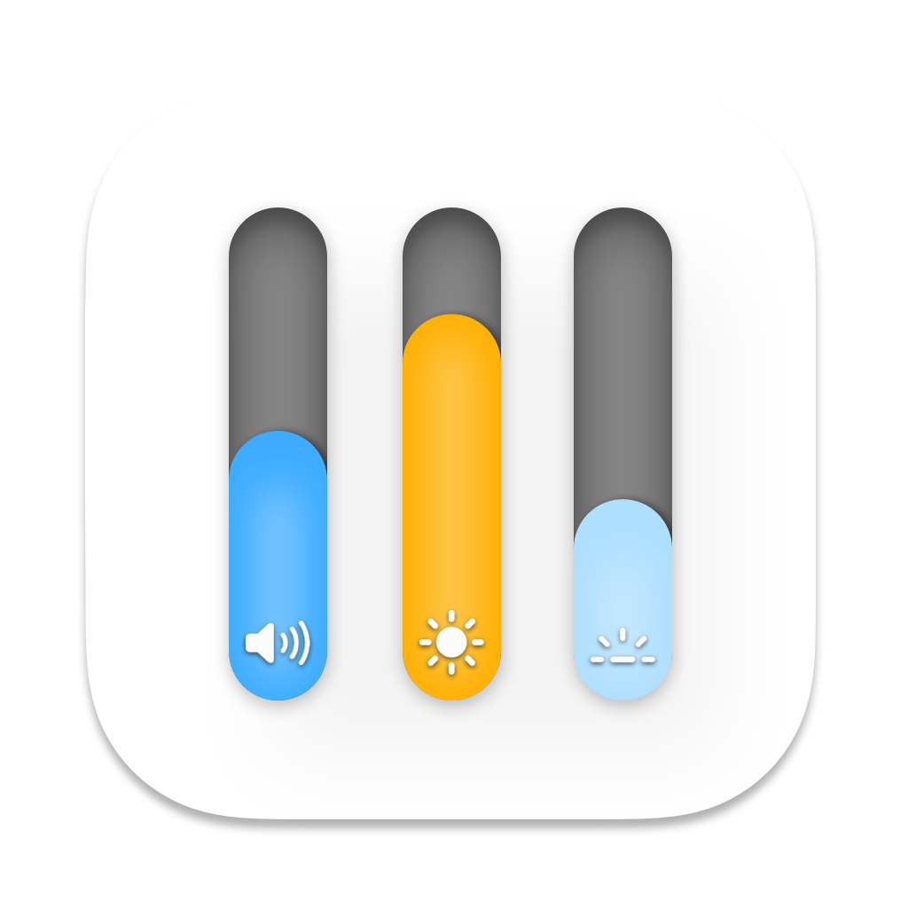

<!--©Alexander Perathoner 19/03/2020-->

 

# SlimHUD

The macOS HUD, redesigned.

Every day you change your volume or brightness, an ugly and unbelievably old overlay animation appears. *SlimHUD* is what you need.
## Features
Instead of a large, bulky square in the middle of your screen, a small and slim bar appears on the side.

<kbd></kbd>
  

There are several appearance effects that you can tailor to your liking.

  

You can choose from multiple appearance animations.

<body>⠀</body>

<body>⠀</body>

<body>⠀</body>

<body>⠀</body>

<body>⠀</body>

<body>⠀</body>

 

 

  

Every HUD (volume, brightness, keyboard backlight) has its own style.

 <body>⠀</body>

  <body>⠀</body>

  

The HUDs can appear on any side: left, right, bottom or top. It's up to you!

 <kbd></kbd>
 <kbd></kbd>

 <kbd></kbd>
 <kbd></kbd>

## Configuration
Documentation is available in the [wiki](https://github.com/AlexPerathoner/SlimHUD/wiki/Configure-SlimHUD).

## Installation
You can use `brew install slimhud`!

Or, download the [latest release](https://github.com/AlexPerathoner/SlimHUD/releases/latest) and move it to `/Applications`.  
Credits to [GameParrot](https://github.com/GameParrot) for making it so easy!

### Uninstalling
To uninstall, just delete SlimHUD from `/Applications`.  
Sorry to see you go!

## Credits
Thanks to [w0lfschild](https://github.com/w0lfschild) ([cleanHUD](https://github.com/w0lfschild/cleanHUD)) and [massimobio](https://github.com/massimobio) ([ProgressHUD-Mac](https://github.com/massimobio/ProgressHUD-Mac)) for inspiring me to create this project.
 
Thanks to [pirate](https://github.com/pirate) and [kaunteya](https://github.com/kaunteya), whose code from [mac-keyboard-brightness](https://github.com/pirate/mac-keyboard-brightness) and [ProgressKit](https://github.com/kaunteya/ProgressKit) (respectively) was used to complete this project.

And, thanks to [reitermarkus](https://github.com/reitermarkus), [ans87gh](https://github.com/ans87gh) and [p-linnane](https://github.com/p-linnane) for adding this project to Homebrew!
 
SlimHUD is using [Sparkle](https://sparkle-project.org) to support automatic updates. Binaries are stored on GitHub and all connections use HTTPS.

## Support
Starring this project is already great support! If you want to support me even more, you can buy me a beer! :D  
 

## License

This project is licensed under the GPL-3.0 License - see the [LICENSE.md](LICENSE.md) file for details

