<!--©Alexander Perathoner 19/03/2020-->

 

# SlimHUD

Replacement for MacOS' HUDs.

Every day you change your volume or brightness and an ugly and unbelievably old overlay animation appears. *SlimHUD* is what you need.
## Features - Settings
Each feature can be toggled from the settings window. To access the settings window search the SlimHUD icon in you menu app and select `Settings...`

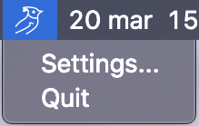

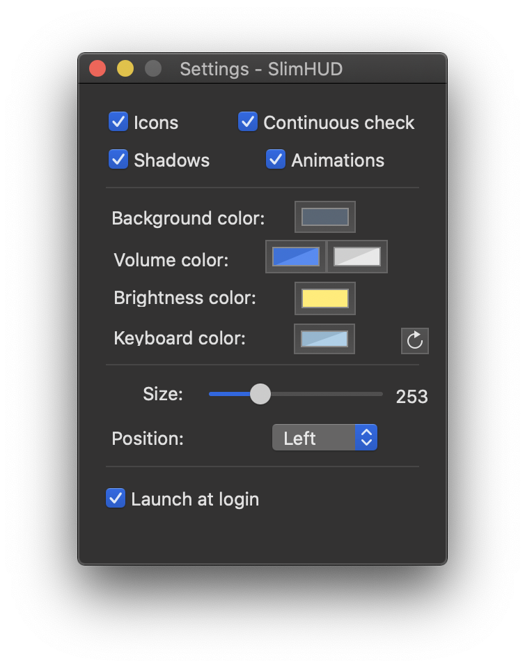

Here's a full list of the features:

* When changing volume / brightness / keyboard's backlight a small icon is shown under the bar. The icons are:

	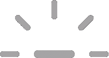
	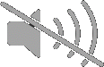
	
	

	

* If you don't like the flat look of the bar you can enable a shadow effect.

	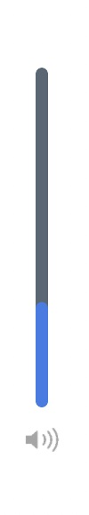
	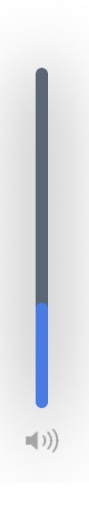

* If you don't like the slide-in animation you can disable it. The bar will then just appear and disappear. 

* Continuously check for changes (*recommended if you use a TouchBar*): shows the HUDs when using the volume / brightness slider.

* Each bar (volume / brightness / keyboard's backlight) has it's own color. If you want to reset the colors to the default values click on the reset icon. The background color is the same for every bar. You can also choose the color of the volume when its muted.

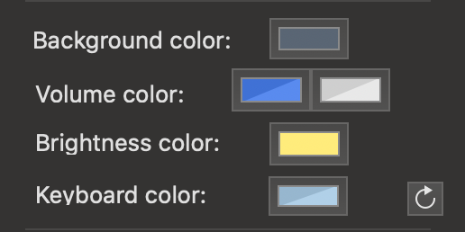

* Each icon (volume / brightness / keyboard's backlight) also has it's own color! [1](#note1)

* If you think that the default bar is too small you can easily adjust its size.

|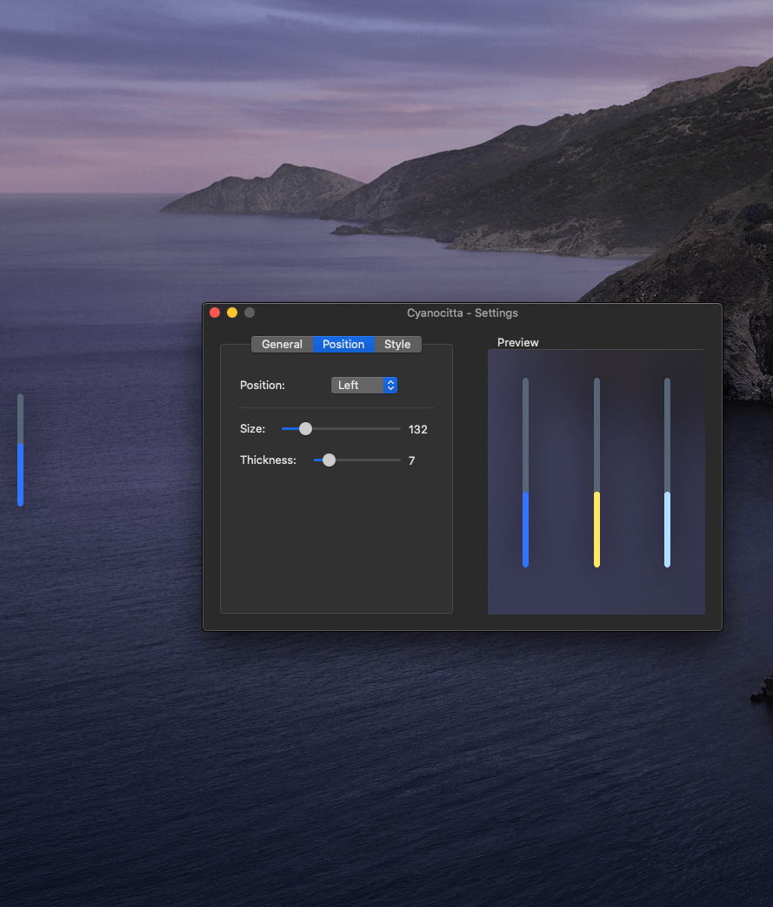|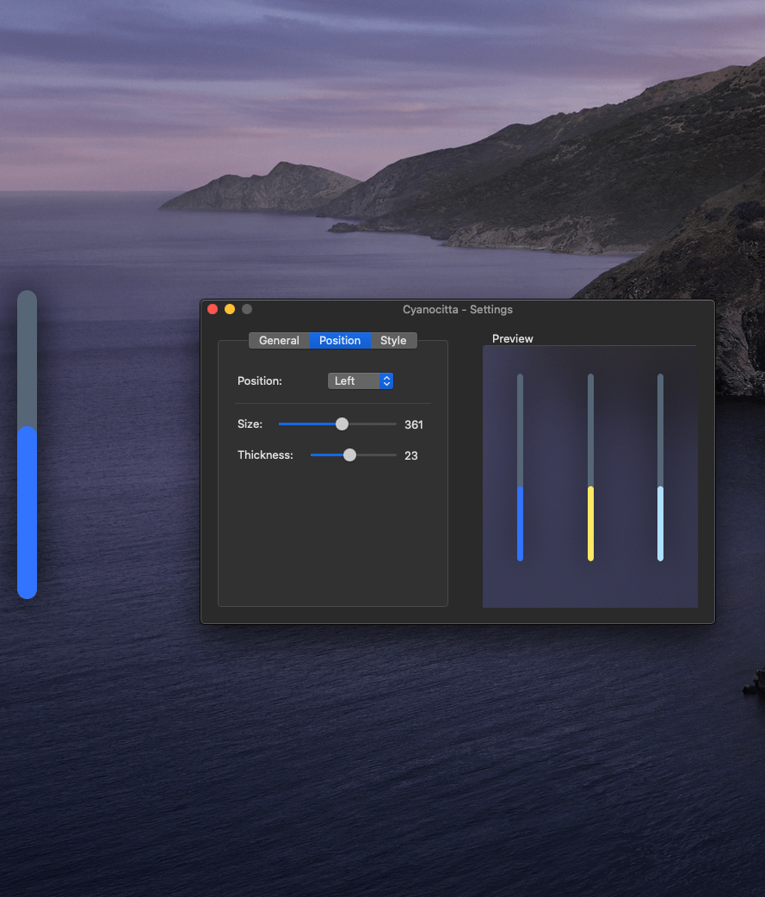|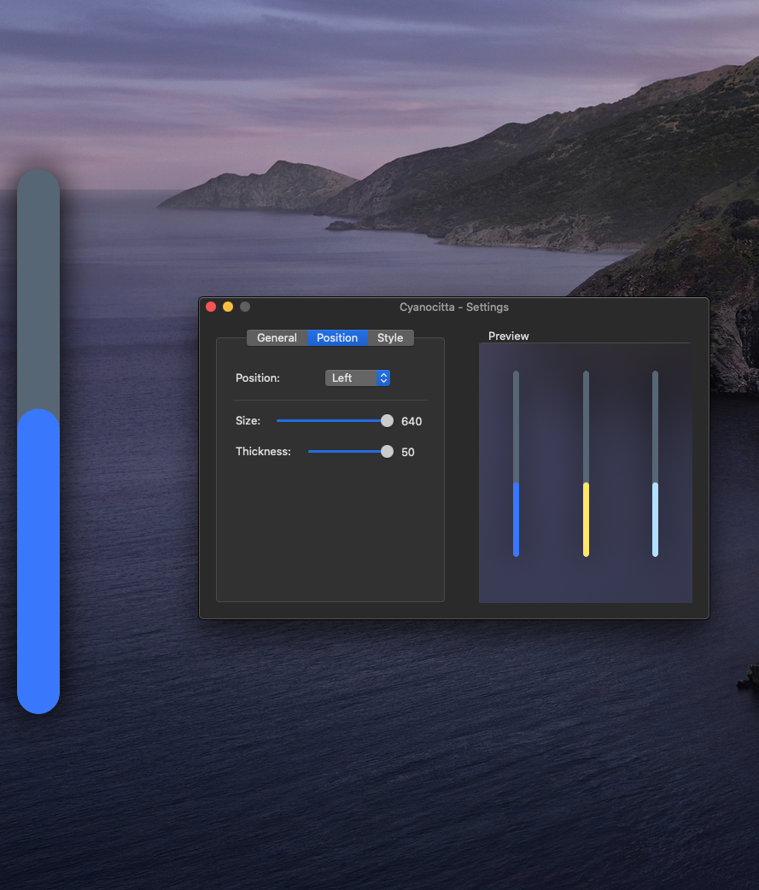|
|--:|---|--:|

* The HUDs can appear on any edge: left, right, bottom or top; it's up to you!

|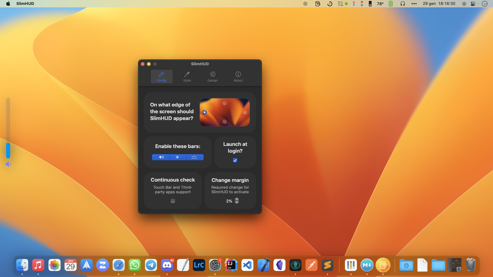|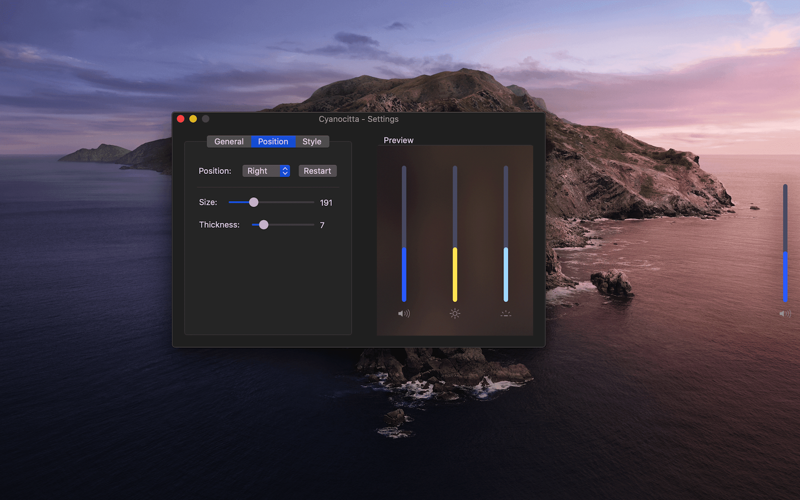|
|--:|---|
|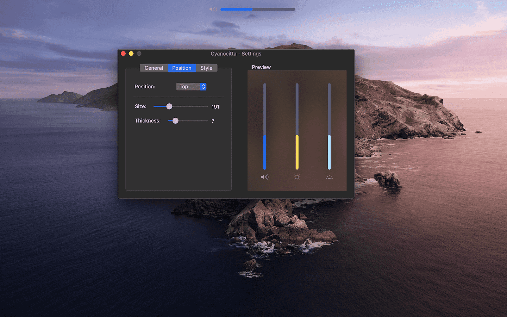|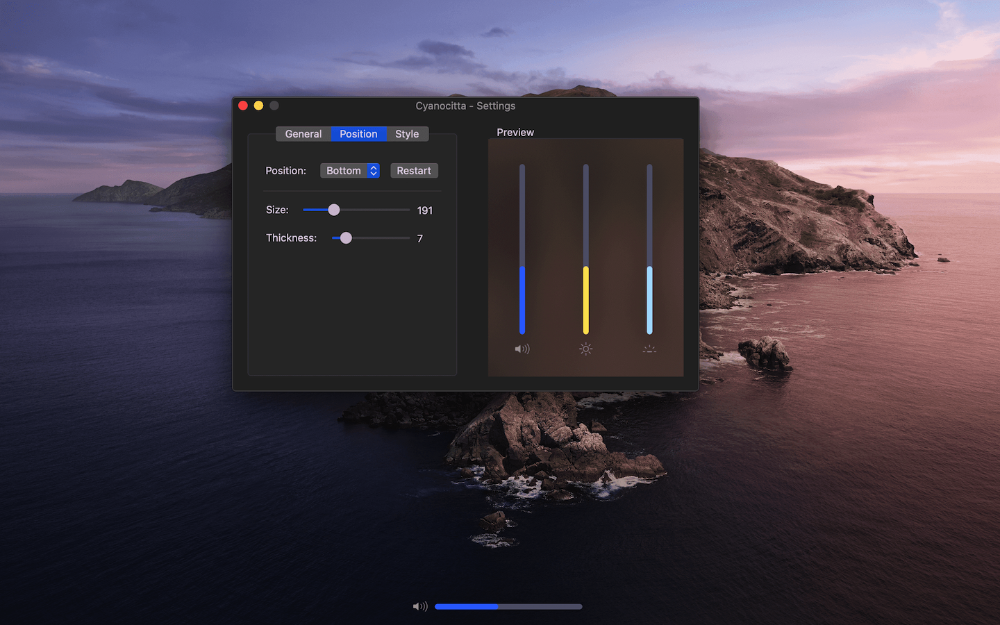|

* Lastly don't forget to **enable the launch at login function!**

[1](#note1):
> Only available in MacOS 10.14 and later.

## Installation
You can use `brew install slimhud`!

Or download the [latest release](https://github.com/AlexPerathoner/SlimHUD/releases/latest) and move it to `/Applications`.

Credits to [GameParrot](https://github.com/GameParrot) for making it so easy!

### Uninstalling
If you'd like to restore the system's HUDs:

1. Disable "launch at login" or delete SlimHUD from `/Applications`

## Credits
Thanks to [w0lfschild](https://gist.github.com/w0lfschild) and [massimobio](https://gist.github.com/massimobio) for creating respectively
 [cleanHUD](https://github.com/w0lfschild/cleanHUD) and [ProgressHUD-Mac](https://github.com/massimobio/ProgressHUD-Mac) and inspiring me to create this project.
 
Also thanks to [pirate](https://gist.github.com/pirate) and [kaunteya](https://gist.github.com/kaunteya), whose code from these project ([mac-keyboard-brightness](https://github.com/pirate/mac-keyboard-brightness) and [ProgressKit](https://github.com/kaunteya/ProgressKit)) was used to complete this project.

Thanks to [reitermarkus](https://gist.github.com/reitermarkus), [ans87gh](https://gist.github.com/ans87gh) and [p-linnane](https://gist.github.com/p-linnane) for adding this project to brew.
 
SlimHUD is using [Sparkle](https://sparkle-project.org) to support automatic updates. Binaries are stored on GitHub and connections use HTTPs.

## Support
Even starring this project is a great support! If you want to support me even more, you can buy me a beer! :D

 

## License

This project is licensed under the GPL-3.0 License - see the [LICENSE.md](LICENSE.md) file for details

