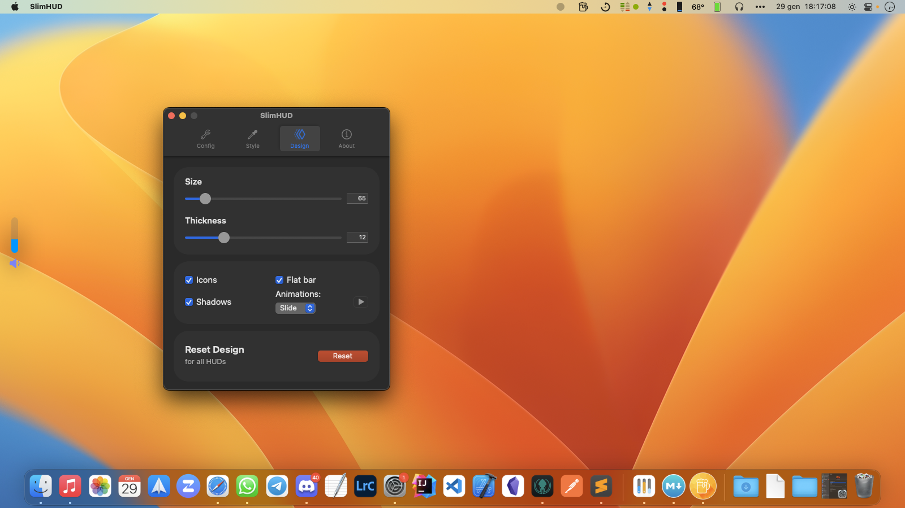
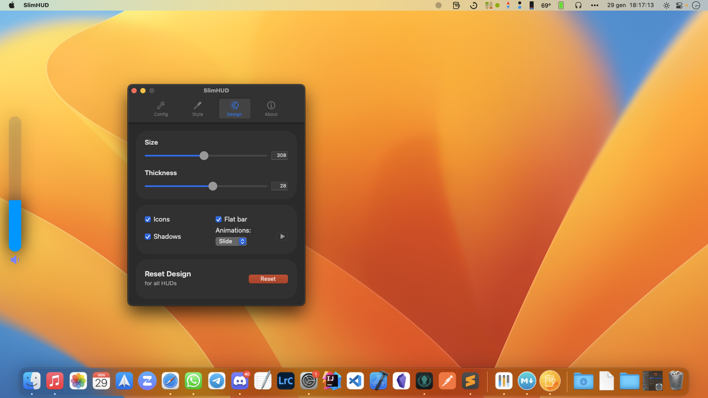
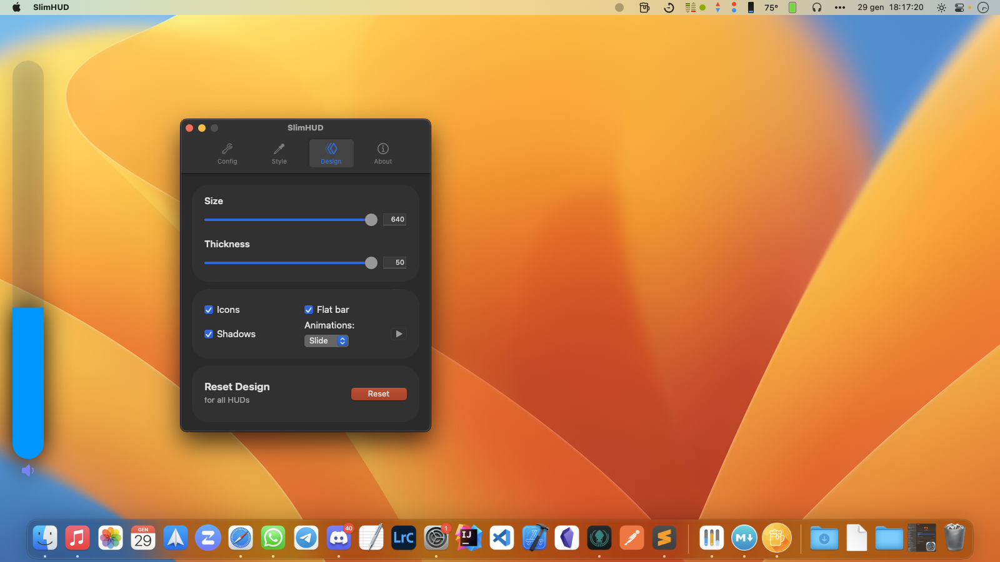
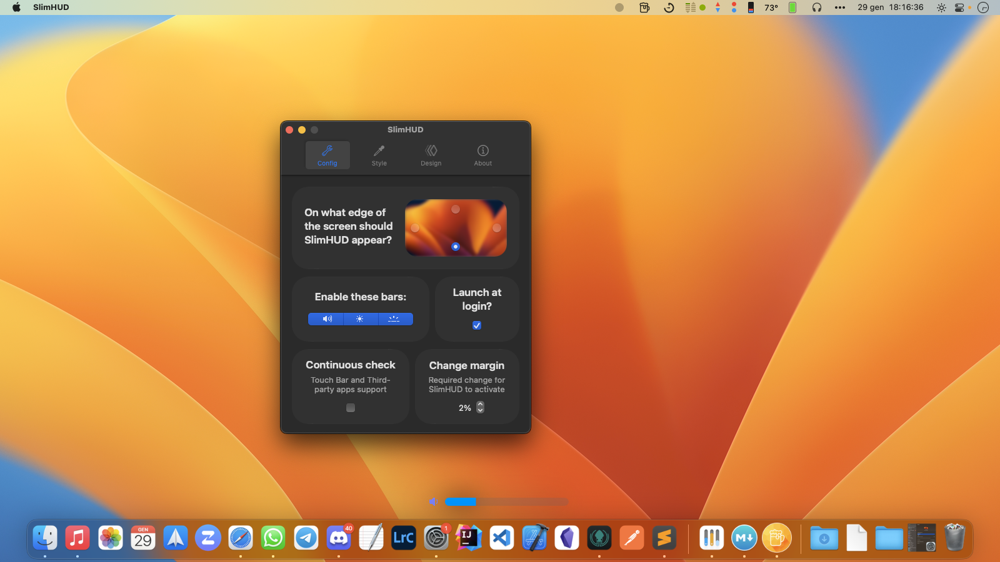

<!--©Alexander Perathoner 19/03/2020-->

 

# SlimHUD

Replacement for MacOS' HUDs.

Every day you change your volume or brightness and an ugly and unbelievably old overlay animation appears. *SlimHUD* is what you need.
## Features - Settings
Each feature can be toggled from the settings window.<br>To access the settings window search the SlimHUD icon in you menu app and select **Settings...**


<p align="center">

</p>

Here's a full list of the features:

* When changing volume / brightness / keyboard's backlight a small icon is shown under the bar. The icons are:

<p align="center">
	
	
	
	
</p>	


* If you don't like the flat look of the bar you can enable a shadow effect.
<p align="center">
	
	
</p>


* If you don't like the slide-in animation you can disable it. The bar will then just appear and disappear. 

<p align="center">


</p>

* Continuously check for changes (*reccomended if you have the TouchBar*): SlimHUD usually shows the volume bar when relative key has been pressed. This means that if you use the volume slider on your TouchBar nothing won't show up. <br>Note that enabling this option *will* fix this problem, but will also increase the CPU usage (which will still be almost none)

* Each bar (volume / brightness / keyboard's backlight) has it's own color. If you want to reset the colors to the default values click on the reset icon.<br>The background color is the same for every bar.<br>You can also choose the color of the volume when its muted.
<p align="center">

</p>

* Each icon (volume / brightness / keyboard's backlight) also has it's own color! <sup>[1](#note1)</sup>

* If you think that the default bar is too small you can easily adjust its size.

||||
|--:|---|--:|


* You can change the position the bar will appear: on the left, right, bottom or top; it's up to you!<br>Note that when you change the orientation of the bar (E.g. left->bottom or right->top) you need to restart SlimHUD.<br>

|||
|--:|---|
|||


* Lastly don't forget to **enable the launch at login function!**

<a name="note1"></a><sup>[1](#note1)</sup>:
> Only available in MacOS 10.14 and later.

## Installation
Download the [latest release](https://github.com/AlexPerathoner/SlimHUD/releases/latest).

Launching SlimHud is easy: copy the app into your Application's folder and then open it.
<br>**However**, as you probably also want it to replace MacOS' HUDs we'll have to follow a few steps more...<br>Please note that the following instructions will temporarily deactivate Sysem Integrity Protection. By proceeding you acknowledge that you are aware of which risks this leads to.<br>But don't be scared, just follow everything and you should be fine (source: [here](https://alanvitullo.wordpress.com/2018/02/20/remove-control-overlay-on-mac-os-high-sierra/) and [here](https://www.reddit.com/r/MacOS/comments/caiue5/macos_catalina_readonly_file_system_with_sip/)):

**Note: I haven't found a safe way of overriding data on your boot disk under MacOS Big Sur yet. This method works for ≤10.15.x**
This means that SlimHUD' HUDs will still be visible, but the system HUDs will be visible as well.

1. Enter Recovery Mode by restarting your mac and holding ⌘+R while it's booting up.
2. Launch the terminal by clicking on Utilities > Terminal.
3. Disable SIP with ```csrutil disable```.
4. Restart your mac and login into an admin account.
5. Run ```sudo mount -uw /; killall Finder``` in your terminal. <sup>[2](#note2)</sup>
6. Now run ```sudo nano /System/Library/LaunchAgents/com.apple.OSDUIHelper.plist```.
6. Remove all of the text between \<plist version=”1.0″> and \</plist>. Save the file by hitting control + X, answering yes and hitting return.
8. Re-enter Recovery mode.
9. Enable SIP with ```csrutil enable```. 

You have now successfully replaced those ugly and old overlays! Congrats!

For future updates it won't be necessary to go through all of these steps. Just copy the [latest release](https://github.com/AlexPerathoner/SlimHUD/releases/latest) into your application Folder.<br>After version `1.3.0` you can check for updates from inside the app.

#### Explanation
<a name="note2"></a><sup>[2](#note2)</sup>:
> sudo allows a permitted user to execute a command as the superuser or another user.
Mount is used to mount disks. The -u flag indicates that the status of an already mounted file system should be changed. -w means to mount the file system read-write. The file system is "/" aka root.
The killall utility kills processes selected by name. Since it's Finder, it will just restart and reflect the change you've just made.
This isn't permanent, there are more steps involved for that.

Source: [reddit](https://www.reddit.com/r/osx/comments/czkgn9/how_to_change_systemlibrarylaunchagents_in/eyzm42w?utm_source=share&utm_medium=web2x)

This is needed as in the last versions of MacOS the system files (like /System/Library/LaunchAgents/com.apple.OSDUIHelper.plist that you'll modify in step 6) are stored in a different disk partition and being an administrator and having System Integrity Protection disabled still isn't enough to access them.

PS: note that the right command is `sudo mount -uw /`, not `sudo mount -uw`


### Uninstalling
If you'd like to restore the system's HUDs follow the same steps described above. With the [latest release](https://github.com/AlexPerathoner/SlimHUD/releases/latest) a copy of the text you deleted from ```/System/Library/LaunchAgents/com.apple.OSDUIHelper.plist``` is provided. Copy it between \<plist version=”1.0″> and \</plist>.


## Credits
Thanks to [w0lfschild](https://gist.github.com/w0lfschild) and [massimobio](https://gist.github.com/massimobio) for creating respectively
 [cleanHUD](https://github.com/w0lfschild/cleanHUD) and [ProgressHUD-Mac](https://github.com/massimobio/ProgressHUD-Mac) and inspiring me to create this project.
 
 Also thanks to [pirate](https://gist.github.com/pirate) and [kaunteya](https://gist.github.com/kaunteya), whose code from these project ([mac-keyboard-brightness](https://github.com/pirate/mac-keyboard-brightness) and [ProgressKit](https://github.com/kaunteya/ProgressKit)) was used to complete this project.
 
 SlimHUD is using [Sparkle](https://sparkle-project.org) to support automatic updates. Binaries are stored on GitHub and connections use HTTPs.

## License

This project is licensed under the GPL-3.0 License - see the [LICENSE.md](LICENSE.md) file for details

---
Donations are welcome! 

[](https://paypal.me/AlexanderPerathoner)
