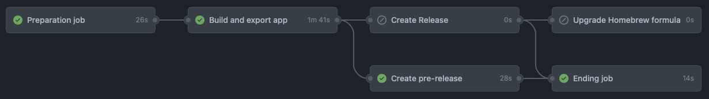

## CI

List of CI jobs:
- release.yml: triggered by `/release` comment on a pull request. Can also be triggered by `/release beta` to create a beta release.
- swift-lint.yml: triggered by pushes. Runs SwiftLint on the project using the `.swiftlint.yml` configuration file. Runs with `--fix` to automatically fix some issues.
- xcode-build.yml: triggered by pushes to pull requests and to develop. Builds the project in Xcode and runs the tests. Takes long time to run due to UI tests.

In addition to these jobs, [SonarCloud](https://sonarcloud.io/project/overview?id=alexpera_slimhud) is used to analyze the code quality. It is triggered inside the `xcode-build.yml` job.

## Testing

### UI Tests

UI tests are
- flaky
- slow

For these reasons the current configuration is as follow:
- Pushes to `develop` and pull requests to `develop` run `xcode-build.yml` which runs the UI tests.
    - Being flaky, failing UI tests are tried again up to 20 times. If they fail 20 times, they are marked as failed by the `xcodebuild` exit code.
- Once the tests ran in `xcode-build.yml`, another check is created with the name "Unit Test Results". This check:
    - ..includes a report of all tests and the coverage. 
    - ..will always succeed, independently of the result of any test. This is because tests which have failed multiple times, and then succeeded, are marked as failed (multiple times) in the report.
- If tests do fail, the `xcode-build.yml` job will fail, and the "Unit Test Results" check will be marked as successful. In `xcode-build.yml`'s logs, the failed tests will be listed. In the "Unit Test Results" check, there will be additional information about the failed tests (including screenshots, for UI tests).

## Releasing

1. Make sure [Release notes](../ReleaseNotes.md) are up to date and formatted correctly:
    ```markdown
    # x.y.m - Title latest release
    * Feature 1
    * Feature 2

    # x.y.n - Title of previous release
    ...
    ```
2. Create a pull request `develop` -> `master`, wait for CI. See [CI](#ci) for more info.
3. Comment `/release` on the pull request to trigger the release process. See [Detailed release process](#detailed-release-process) for more info.

## Detailed release process



1. Preparation job
    1. Triggered by `/release` comment on a pull request to `master`. Or by `/release beta` to create a beta release.
    2. Retrieve signing certificates from GitHub secrets.
    3. Build the project in Xcode.
    4. Check if PR is ready to be merged (no conflicts, no pending reviews, etc.).
    5. Extract latest changes from `ReleaseNotes.md`.
    6. Generate html changelog from `ReleaseNotes.md` for Sparkle.
    7. Check if version is valid (must be higher than previous version).
    8. Check if there is at least one new feature.
    9. Merge `master` into `develop` to keep them in sync. This is needed because a beta release is created directly on `master`.
2. Build and export
    1. Replace version in project with version in `ReleaseNotes.md`.
    2. Install provisioning profiles and signing certificates. See [release.yml](/.github/workflows/release.yml) for more info.
    3. Use latest Xcode version
    4. Build and archive the project.
    5. Export the archive as a `.zip` file.
3. Release / Release beta
    1. Update `appcast.xml` with the Sparkle tool. Publish to beta channel if beta release. Construct download URL from GitHub release.
    2. Commit changes
        - Beta: only appcast file, directly on `master`.
        - Normal release: appcast file and project file (version update) on `develop`, then merge PR.
    3. Create GH release with the `.zip` file and the changelog.
4. Upgrade Homebrew
    1. SlimHUD is available on Homebrew Cask. This job updates the cask formula. See [homebrew bump-cask-pr](https://docs.brew.sh/How-To-Open-a-Homebrew-Pull-Request) for more info.
5. Finish up
    1. Add reaction to the PR to indicate the release process is finished.k
    2. Update deployment status in GH
    3. Delete artifacts (used to share data between jobs)
